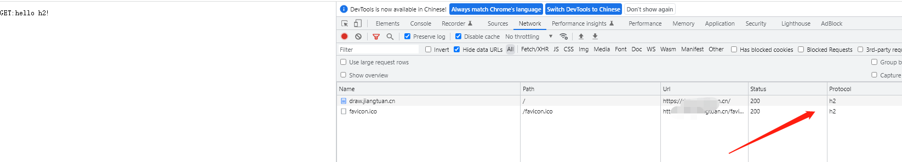

# 基于workerman 实现http2服务端
> 已支持h2， h2c
#### 添加host
  127.0.0.1 xxxxxxxx.cn

#### 修改证书路径 (如果是h2需要此步骤)
```
'ssl' => [
     'local_cert' => './draw.xxx.cn_bundle.pem', //修改成自己的路径
     'local_pk' => './draw.xxx.cn.key', // 修改成自己的路径
]
```

####运行

```
composer install
```

```
php http2_server_h2 start  (常见浏览器只支持此模式)
```
或者

```
composer install
```
```
php http2_server_h2c start    (HTTP1升级http2的方式)
```

#### 浏览器打开地址查看效果
  https://xxxx.cn/
  


# 基于workerman 实现Grpc服务端
> 已支持grpc的四种模式
#### 编译 workerman的protoc插件

下载protoc插件并放入系统Path目录里面

插件地址https://github.com/xioayangguang/workerman_grpc_plugin

编译后放入到系统Path目录里面

#### 安装依赖
```
composer install
```
#### 编写自己的proto 并生成php服务端代码
```
protoc --php_out=. --workerman_out=. hello.proto
```

#### 实现grpc服务端逻辑
具体可参考 proto/GreeterServiceExample.php


#### 运行服务端
```
php grpc.php start  
```
#### 运行客户端
运行golang编写的grpc客户端

```
cd example-go-client && go run main.go
or
cd example-go-client && ./main.exe
```


