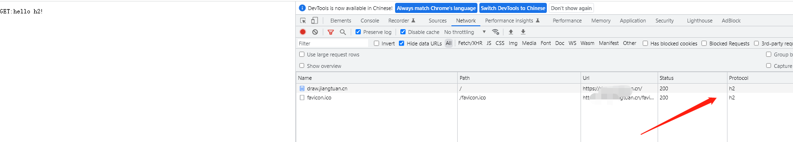
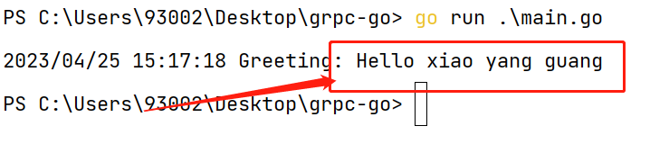

# 基于workerman 实现http2服务端

* 目前握手方式只实现ssl协商上层协议
### 运行http2服务端的方式
* 修改证书  http2_server.php

```
'ssl' => [
     'local_cert' => './draw.jiangtuan.cn_bundle.pem', //修改成自己的路径
     'local_pk' => './draw.jiangtuan.cn.key', // 修改成自己的路径
     'verify_peer' => false,
     'allow_self_signed' => true,
]
```

运行方式： 

```
composer install
```


```
php http2_server.php start
```

* 浏览器打开
https://xxxxxx



# 实现grpc 服务端
### 运行grpc服务端的方式

* 修改证书  grpc_server.php

```
'ssl' => [
     'local_cert' => './draw.jiangtuan.cn_bundle.pem', //修改成自己的路径
     'local_pk' => './draw.jiangtuan.cn.key', // 修改成自己的路径
     'verify_peer' => false,
     'allow_self_signed' => true,
]
```

运行方式：

```
composer install
```

```
php grpc_server.php start
```

* 进入go-grpc-client-example 修改main.go证书为自己的

```
creds, err0 := credentials.NewClientTLSFromFile("./draw.jiangtuan.cn_bundle.pem", "draw.jiangtuan.cn")

```

* 运行grpc客户端
```
go run main.go
```
* 运行结果

